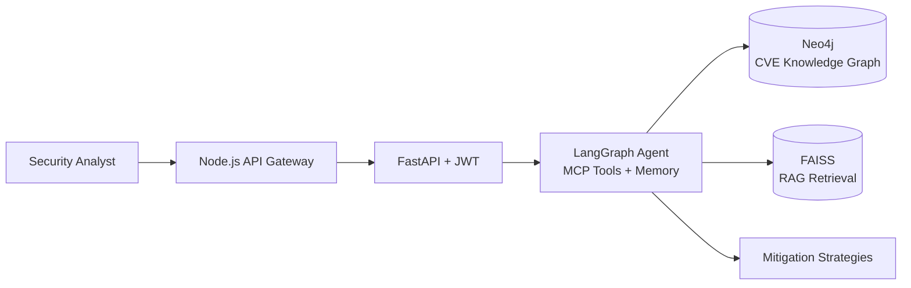

<div align="center">


<a href="https://github.com/VIKASHL25">
  
</a>

<br/>


[](https://www.linkedin.com/in/vikas-hl)
[](https://leetcode.com/u/Vikashl)
[](mailto:vikaslokesh360@gmail.com)

</div>

---

## 👋 About Me

I'm a third-year **Information Science & Engineering** student at **Dayananda Sagar College of Engineering, Bengaluru**, and I like building AI that does real work rather than demos that only look good in a notebook.

My projects sit where three things meet: **agentic AI** (LangGraph, MCP, RAG), **applied machine learning** (physics-informed models, explainable AI) and **production-style backends** (FastAPI, microservices, JWT, Docker).

```python
class VikasHL:
    role       = "AI/ML Enthusiast | Agentic AI & Backend Development"
    education  = "B.E. ISE @ DSCE, Bengaluru (2023 - 2027), CGPA 9.1"
    location   = "Bangalore, India"
    focus      = ["Agentic AI", "RAG Pipelines", "ML Systems", "Backend APIs"]
    approach   = "Understand the problem, design the system, ship it, explain it"

    def currently(self):
        return "Building multi-agent workflows & competing in hackathons 🏆"
```

---

## 🛠️ Tech Stack

<div align="center">

**Languages**


**Generative AI & Agentic Frameworks**


**ML / Deep Learning**


**Backend & Deployment**


**Databases & Vector Stores**


</div>

---

## 🚀 Featured Projects

### ✈️ AI-Enabled Digital Twin for UAV Engine Health Monitoring & Fault Prediction
`Python` `FastAPI` `XGBoost` `SHAP` `MongoDB` `Microservices` `WebSockets` `React`

A **physics-informed digital twin** for MALE UAV aero piston engines. It fuses CAN bus telemetry with thermodynamic residual features to predict faults and estimate **Remaining Useful Life (RUL)** in real time, replacing conventional threshold-based monitoring.

- 🧪 **4 XGBoost models** (regression + classification) across a **5-microservice architecture**
- 📈 **R² = 0.9996** on held-out, mission-level unseen test data
- ⚡ **Sub-3 ms** onboard inference latency
- 🔍 **SHAP-based explainable AI** so every prediction can be justified
- 📡 Real-time **WebSocket telemetry pipeline** feeding a **React.js dashboard** with live mission replay and fault-injection testing
- 🗄️ **MongoDB Atlas** for fleet-wide historical health tracking and post-flight analysis

---

### 🛡️ [Attack Path Visualisation & Remediation through Graph Intelligence](https://github.com/VIKASHL25/attack-path-visualisation)
`Python` `FastAPI` `LangChain` `LangGraph` `MCP` `FAISS` `Neo4j` `Node.js`

A cybersecurity platform that maps attack vectors on a **Neo4j knowledge graph** built from CVE data, so security teams can see likely breach paths through their network infrastructure.

- 🤖 **Agentic AI** with LangChain + LangGraph, **MCP tool calling** and stateful agent memory
- 📚 **RAG-based retrieval** with HuggingFace embeddings to generate real-time mitigation strategies
- 🔐 **FastAPI backend with JWT auth**, plus a **Node.js API gateway** routing to AI services and Neo4j



---

### 🧠 [Code-Mind: AI Code & Data Analysis Platform](https://github.com/VIKASHL25/CodeMind)
`Python` `FastAPI` `LangChain` `LangGraph` `MongoDB` `WebSockets`

An AI developer tool for **real-time code analysis and data visualisation**, driven by natural-language queries through **LangGraph agentic workflows** with multi-step tool calling.

- 🌊 **WebSocket streaming** of LLM responses, so you watch the AI's reasoning steps as they happen
- 🐞 **Dual-mode agents:** one for bug detection and code optimisation, one for CSV analysis with automated **matplotlib** charts

---

### More work

| Project | What it is |
|---|---|
| 💬 [**RAG Conversation Engine**](https://github.com/VIKASHL25/Rag-conversation-engine) | Retrieval-Augmented Generation engine for grounded, context-aware conversations |
| 📦 [**Amazon ML Challenge 2025**](https://github.com/VIKASHL25/amazon-ml-2025) | ML competition work: data exploration, modelling and experimentation |
| 🏆 [**SIH '26**](https://github.com/VIKASHL25/SIH-26) · [**SIH '26 (26228)**](https://github.com/VIKASHL25/SIH-26228) | Smart India Hackathon 2026 solutions |

---

## 💼 Experience

**Havells Voice AI Beta Program** · *Havells CRI, Providya Industry-Academia Collaboration Programme* · Feb 2026 – Jun 2026 · 📜 Certificate

- Tested **NLP-based voice commands** across Havells smart appliances (washing machine, AC, fan, air purifier, water filter), validating recognition accuracy and device response
- Found, documented and reported bugs in voice-command and device-response pipelines, and proposed fixes to improve **NLU accuracy** and appliance-control reliability

---

## 🎓 Education

**B.E. in Information Science & Engineering**, Dayananda Sagar College of Engineering, Bengaluru · Oct 2023 – Jul 2027
**CGPA: 9.1 / 10** · Coursework: Machine Learning · Deep Learning · DBMS · Natural Language Processing

---

## 📊 GitHub & Coding Stats

<div align="center">


<a href="https://leetcode.com/u/Vikashl"></a>

</div>

---

## 🎯 Currently

| | |
|---|---|
| 🔭 **Building** | Agentic AI workflows with LangGraph & MCP |
| 🌱 **Exploring** | Fine-tuning, multi-agent systems, production RAG |
| 🤝 **Open to** | Internships, hackathon teams, AI/ML collaborations |
| 💬 **Ask me about** | RAG pipelines, LangGraph agents, FastAPI backends, digital twins |

---

<div align="center">

### 📫 Let's build something together

[](https://www.linkedin.com/in/vikas-hl)
[](mailto:vikaslokesh360@gmail.com)

*"Don't just call the model. Build the system around it."* 💡


</div>
