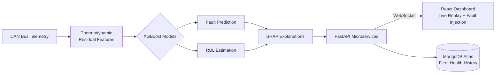
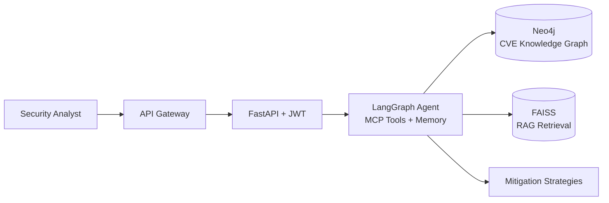
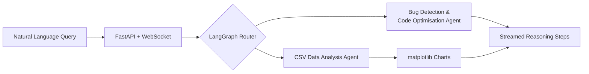

<div align="center">


<a href="https://github.com/VIKASHL25">
  
</a>

<br/><br/>

[](https://www.linkedin.com/in/vikas-hl)
[](https://leetcode.com/u/Vikashl)
[](mailto:vikaslokesh360@gmail.com)
[](#-education)

</div>


## 👋 About Me

I'm a third-year **Information Science & Engineering** student at **Dayananda Sagar College of Engineering, Bengaluru**. I like building AI that does real work, not demos that only look good in a notebook.

My projects sit where four things meet:

- 🤖 **Agentic AI:** LangGraph, MCP tool calling, RAG pipelines and stateful agent memory
- 📈 **Applied ML:** physics-informed models, explainable AI, real-time inference
- ⚙️ **Backend engineering:** FastAPI, REST APIs, JWT auth and microservice architectures
- 🐳 **Containers & orchestration:** services packaged with **Docker** and orchestrated with **Kubernetes**

```python
class VikasHL:
    role       = "AI/ML Engineer in the making | Agentic AI & Backend Development"
    education  = "B.E. ISE @ DSCE Bengaluru (2023-2027), CGPA 9.1"
    location   = "Bangalore, India"
    build      = ["LangGraph agents", "RAG pipelines", "FastAPI microservices"]
    ship_with  = ["Docker", "Kubernetes"]
    approach   = "Understand the problem, design the system, ship it, explain it"

    def currently(self):
        return "Building multi-agent workflows and competing in hackathons 🏆"
```


## 🛠️ Tech Stack

<div align="center">

#### Languages


#### Generative AI & Agentic Frameworks
[](https://www.langchain.com/)
[](https://www.langchain.com/langgraph)
[](https://modelcontextprotocol.io/)
[](#)
[](https://huggingface.co/)


#### ML / Deep Learning


#### Backend, Containers & Orchestration


#### Databases & Vector Stores


#### Tools


</div>


## 🚀 Featured Projects

### ✈️ AI-Enabled Digital Twin for UAV Engine Health Monitoring & Fault Prediction
`Python` `FastAPI` `XGBoost` `SHAP` `MongoDB` `Microservices` `WebSockets` `React` `Docker` `Kubernetes`

A **physics-informed digital twin** for MALE UAV aero piston engines. It fuses CAN bus telemetry with thermodynamic residual features to predict faults and estimate **Remaining Useful Life (RUL)** in real time, replacing conventional threshold-based monitoring.

| 🧪 Models | 📈 Accuracy | ⚡ Latency | 🧱 Architecture |
|:---:|:---:|:---:|:---:|
| **4** XGBoost models | **R² = 0.9996** on unseen missions | **< 3 ms** onboard inference | **5** microservices |

- 🔍 **SHAP-based explainable AI** so every prediction can be justified
- 📡 **Real-time WebSocket telemetry pipeline** feeding a **React.js dashboard** with live mission replay and fault-injection testing
- 🗄️ **MongoDB Atlas** for fleet-wide historical health tracking and post-flight analysis




### 🛡️ [Attack Path Visualisation & Remediation through Graph Intelligence](https://github.com/VIKASHL25/attack-path-visualisation)
`Python` `FastAPI` `LangChain` `LangGraph` `MCP` `FAISS` `Neo4j` `Docker`

A cybersecurity platform that maps attack vectors on a **Neo4j knowledge graph** built from CVE data, so security teams can see likely breach paths through their network infrastructure.

- 🤖 **Agentic AI** with LangChain + LangGraph, **MCP tool calling** and stateful agent memory
- 📚 **RAG-based retrieval** with HuggingFace embeddings to generate real-time mitigation strategies
- 🔐 **FastAPI backend with JWT auth** and an API gateway routing requests to the AI services and Neo4j




### 🧠 [Code-Mind: AI Code & Data Analysis Platform](https://github.com/VIKASHL25/CodeMind)
`Python` `FastAPI` `LangChain` `LangGraph` `MongoDB` `WebSockets`

An AI developer tool for **real-time code analysis and data visualisation**, driven by natural-language queries through **LangGraph agentic workflows** with multi-step tool calling.

- 🌊 **WebSocket streaming** of LLM responses, so you can watch the AI's reasoning steps as they happen
- 🐞 **Dual-mode agents:** one for bug detection and code optimisation, one for CSV analysis with automated **matplotlib** charts




### 📂 More work

| Project | What it is |
|---|---|
| 💬 [**RAG Conversation Engine**](https://github.com/VIKASHL25/Rag-conversation-engine) | Retrieval-Augmented Generation engine for grounded, context-aware conversations |
| 📦 [**Amazon ML Challenge 2025**](https://github.com/VIKASHL25/amazon-ml-2025) | ML competition work: data exploration, modelling and experimentation |
| 🏆 [**SIH '26**](https://github.com/VIKASHL25/SIH-26) · [**SIH '26 (26228)**](https://github.com/VIKASHL25/SIH-26228) | Smart India Hackathon 2026 solutions |


## 🎓 Education

**B.E. in Information Science & Engineering**
Dayananda Sagar College of Engineering, Bengaluru · Oct 2023 – Jul 2027
**CGPA: 9.1 / 10** · Machine Learning · Deep Learning · DBMS · Natural Language Processing


## 🎯 Currently

| | |
|---|---|
| 🔭 **Building** | Agentic AI workflows with LangGraph & MCP |
| 🐳 **Deploying** | Containerised services with Docker, orchestrated on Kubernetes |
| 🌱 **Exploring** | Fine-tuning, multi-agent systems, production-grade RAG |
| 🤝 **Open to** | Internships, hackathon teams, AI/ML collaborations |
| 💬 **Ask me about** | RAG pipelines, LangGraph agents, FastAPI backends, digital twins |

<div align="center">

<br/>

### 📫 Let's build something together

[](https://www.linkedin.com/in/vikas-hl)
[](mailto:vikaslokesh360@gmail.com)

*"Don't just call the model. Build the system around it."* 💡


</div>
